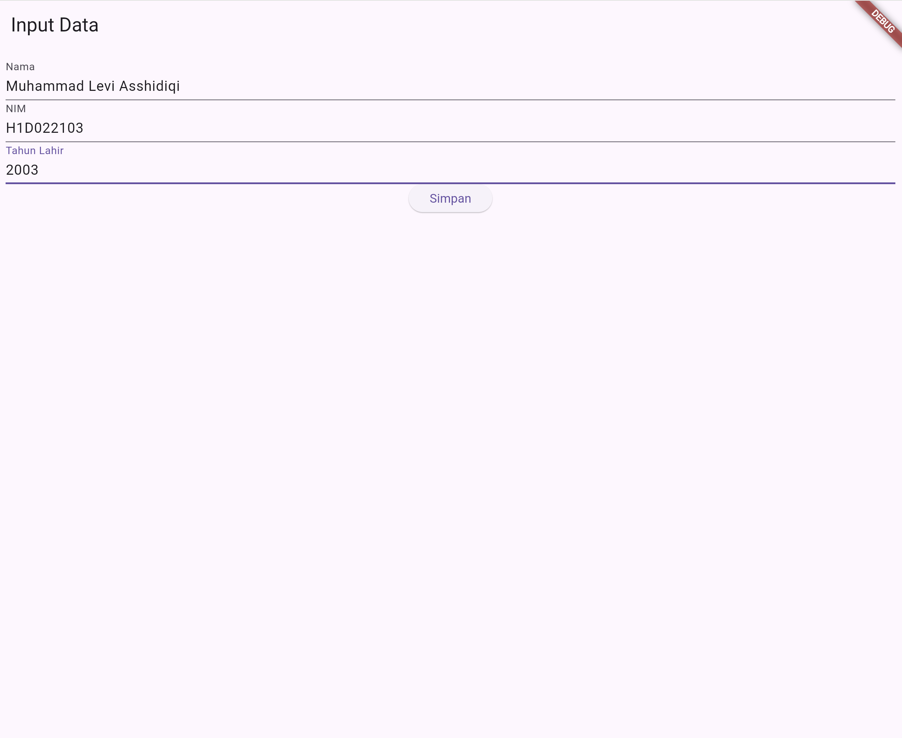
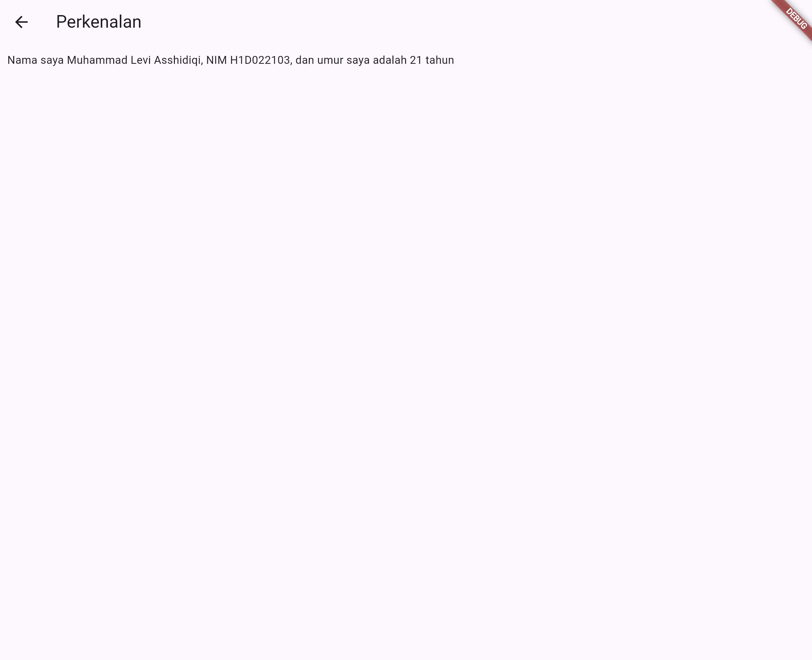

# Tugas Pertemuan 2

Fork dan clone repository ini, lalu jalankan perintah 
```
flutter pub get
```
Buatlah tampilan form yang berisi nama, nim, dan tahun lahir pada file `ui/form_data.dart`, lalu buatlah tampilan hasil dari input data tersebut pada file `ui/tampil_data.dart`

JELASKAN PROSES PASSING DATA DARI FORM MENUJU TAMPILAN DENGAN FILE `README.md`

Buat tampilan semenarik mungkin untuk dilihat.


Nama : Muhammad Levi Asshidiqi

NIM : H1D022103

Shift Baru: A


file `ui/form_data.dart`
```
import '/ui/tampil_data.dart';
import 'package:flutter/material.dart';
import 'package:flutter/widgets.dart';

class FormData extends StatefulWidget {
  const FormData({Key? key}) : super(key: key);

  @override
  FormDataState createState() => FormDataState();
}

class FormDataState extends State<FormData> {
  final _namaController = TextEditingController();
  final _nimController = TextEditingController();
  final _tahunController = TextEditingController();
  @override
  Widget build(BuildContext context) {
    return Scaffold(
      appBar: AppBar(
        title: const Text("Input Data"),
      ),
      body: Container(
        margin: const EdgeInsets.all(10),
        child: Column(
          children: [
            _textboxNama(),
            _textboxNIM(),
            _textboxTahun(),
            _tombolSimpan()
          ],
        ),
      ),
    );
  }

  _textboxNama() {
    return TextField(
      decoration: const InputDecoration(labelText: "Nama"),
      controller: _namaController,
    );
  }

  _textboxNIM() {
    return TextField(
      decoration: const InputDecoration(labelText: "NIM"),
      controller: _nimController,
    );
  }

  _textboxTahun() {
    return TextField(
      decoration: const InputDecoration(labelText: "Tahun Lahir"),
      controller: _tahunController,
    );
  }

  _tombolSimpan() {
    return ElevatedButton(
        onPressed: () {
          String nama = _namaController.text;
          String nim = _nimController.text;
          int tahun = int.parse(_tahunController.text);
          Navigator.of(context).push(MaterialPageRoute(
              builder: (context) =>
                  TampilData(nama: nama, nim: nim, tahun: tahun)));
        },
        child: const Text('Simpan'));
  }
}
```
1. Import Statements
import '/ui/tampil_data.dart';: Mengimpor file tampil_data.dart yang berisi widget untuk menampilkan data yang dimasukkan.
import 'package:flutter/material.dart'; dan import 'package:flutter/widgets.dart';: Mengimpor paket Flutter yang diperlukan untuk menggunakan widget dan material design.
2. Class FormData
FormData adalah widget yang dideklarasikan sebagai StatefulWidget. Widget ini digunakan untuk membuat form input data.
createState: Metode ini mengembalikan instance dari FormDataState, yang menangani state dan logika form.
3. Class FormDataState
_namaController, _nimController, dan _tahunController adalah instance dari TextEditingController yang digunakan untuk mengambil input dari TextField.
build: Metode ini membangun tampilan form, menggunakan Scaffold untuk menyediakan struktur dasar aplikasi dan Column untuk menyusun widget dalam satu kolom.
4. Widget Metode
_textboxNama: Mengembalikan TextField untuk memasukkan nama. controller menghubungkan TextEditingController untuk mendapatkan nilai input.
_textboxNIM: Mengembalikan TextField untuk memasukkan NIM dengan pengaturan yang sama seperti _textboxNama.
_textboxTahun: Mengembalikan TextField untuk memasukkan tahun lahir dengan pengaturan yang sama seperti widget text field lainnya.
5. Tombol Simpan
_tombolSimpan: Mengembalikan ElevatedButton yang, ketika ditekan, akan mengambil nilai dari TextEditingController dan mengonversi tahun menjadi int menggunakan int.parse.
Navigator.of(context).push: Menggunakan Navigator untuk berpindah ke halaman berikutnya, yaitu halaman TampilData dengan data yang telah dimasukkan sebagai parameter.

file `ui/tampil_data.dart`
```
import 'package:flutter/material.dart';

class TampilData extends StatelessWidget {
  final String nama;
  final String nim;
  final int tahun;

  const TampilData({
    Key? key,
    required this.nama,
    required this.nim,
    required this.tahun,
  }) : super(key: key);

  @override
  Widget build(BuildContext context) {
    final int umur = DateTime.now().year - tahun;
    return Scaffold(
      appBar: AppBar(
        title: const Text("Perkenalan"),
      ),
      body: Container(
        margin: const EdgeInsets.all(10),
        child: Column(
          children: [
            Text("Nama saya $nama, NIM $nim, dan umur saya adalah $umur tahun"),
          ],
        ),
      ),
    );
  }
}
```

1. Import Statements
import 'package:flutter/material.dart';: Mengimpor paket Flutter yang diperlukan untuk menggunakan widget dan material design.
2. Class TampilData
TampilData adalah widget yang dideklarasikan sebagai StatelessWidget. Widget ini digunakan untuk menampilkan data yang diterima dari halaman sebelumnya (halaman form).
3. Parameter Konstruktor
final String nama;: Menyimpan nama yang diterima dari halaman form.
final String nim;: Menyimpan NIM yang diterima dari halaman form.
final int tahun;: Menyimpan tahun lahir yang diterima dari halaman form.
Parameter ini ditetapkan sebagai required dalam konstruktor, artinya nilai untuk parameter tersebut harus diberikan saat membuat instance dari widget ini.

4. Metode build
final int umur = DateTime.now().year - tahun;: Menghitung umur berdasarkan tahun lahir yang diterima. Umur dihitung dengan mengurangi tahun lahir dari tahun saat ini.
Scaffold: Widget yang menyediakan struktur dasar aplikasi, termasuk AppBar, Body, dan lainnya.
AppBar: Menyediakan bilah aplikasi dengan judul "Perkenalan".
Container: Menyediakan padding sekitar konten dengan margin 10 piksel di semua sisi.
Column: Menyusun widget dalam kolom vertikal.
Text: Menampilkan teks yang terdiri dari nama, NIM, dan umur yang dihitung.

file `main.dart`
```
import 'ui/form_data.dart';
import 'package:flutter/material.dart';

void main() {
  runApp(const MyApp());
}

class MyApp extends StatelessWidget {
  const MyApp({Key? key}) : super(key: key);

  @override
  Widget build(BuildContext context) {
    return const MaterialApp(
      title: "Aplikasi Flutter Pertama",
      home: FormData(),
    );
  }
}

```

1. Import Statements
import 'ui/form_data.dart';: Mengimpor file form_data.dart yang berisi definisi widget FormData. Ini memungkinkan aplikasi untuk menggunakan widget FormData sebagai tampilan utama.
import 'package:flutter/material.dart';: Mengimpor paket Flutter yang diperlukan untuk menggunakan widget dan material design.
2. Fungsi main
void main() { runApp(const MyApp()); }: Fungsi main adalah titik masuk dari aplikasi Flutter. Fungsi ini memanggil runApp, yang merupakan fungsi bawaan Flutter untuk menjalankan aplikasi.
runApp(const MyApp());: Menjalankan widget MyApp sebagai root widget dari aplikasi Flutter. const menunjukkan bahwa instance MyApp adalah konstanta dan tidak berubah.
3. Class MyApp
MyApp adalah widget yang dideklarasikan sebagai StatelessWidget. Ini berarti widget ini tidak memiliki state yang berubah selama siklus hidupnya.
const MyApp({Key? key}) : super(key: key);: Konstruktor untuk MyApp. const menunjukkan bahwa widget ini adalah konstanta dan tidak akan mengalami perubahan.
4. Metode build pada MyApp
Widget build(BuildContext context): Metode ini membangun tampilan widget MyApp.
MaterialApp: Widget ini adalah root widget untuk aplikasi yang menggunakan material design.
title: "Aplikasi Flutter Pertama": Menetapkan judul aplikasi yang sering digunakan oleh sistem operasi atau ketika aplikasi ditampilkan dalam daftar aplikasi.
home: FormData(): Menetapkan widget FormData sebagai widget home dari aplikasi. Ini adalah halaman utama yang akan ditampilkan ketika aplikasi pertama kali dibuka.
Penjelasan Passing Data
Pada kode ini, tidak ada data yang dipassing langsung dari satu widget ke widget lainnya. Namun, jika kita melihat secara keseluruhan dalam aplikasi, data dipassing dari FormData ke TampilData melalui navigasi:

Pengguna Berinteraksi dengan Form:

Di dalam FormData, pengguna memasukkan data ke dalam form (nama, NIM, tahun lahir).

Navigasi dan Passing Data:

Ketika tombol Simpan pada FormData ditekan, data diambil dari TextEditingController dan dikirimkan ke widget TampilData melalui navigasi menggunakan Navigator.of(context).push. Data ini diteruskan sebagai parameter konstruktor saat membuat instance TampilData.
Menampilkan Data:

TampilData menerima data yang dipassing dan menampilkan informasi yang sesuai.

## Screenshot
Contoh :


